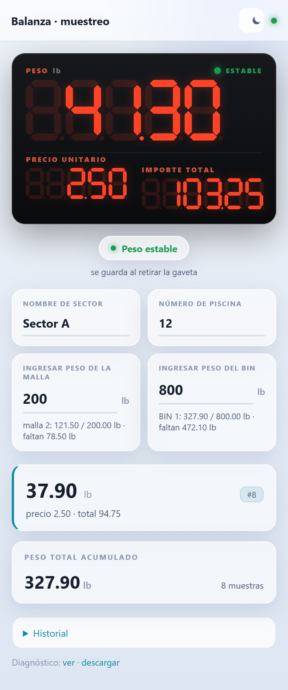
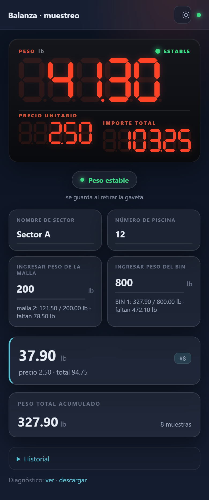
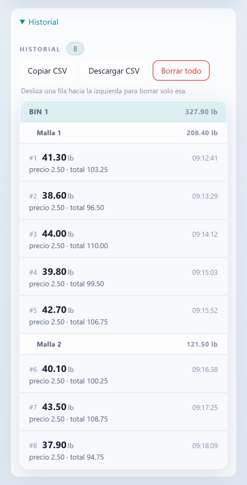
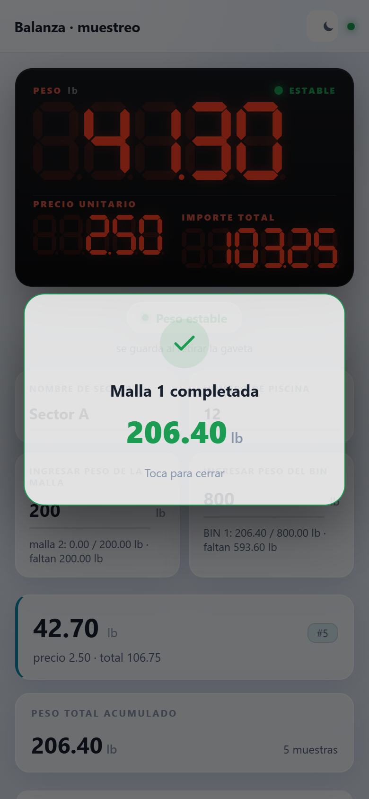
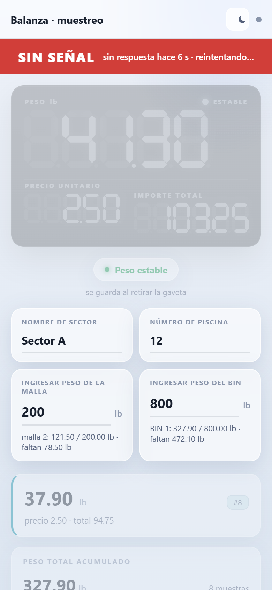

# Peso automático de muestreo

Leer automáticamente el valor de una **balanza cuenta-precio** (placa `ACS-JC36CV28` +
placa de display `WP-91110-2540-V7`, chip `CS2540`) y enviarlo a un sistema de muestreo.

## Panel web

El ESP crea su propia red WiFi y sirve un panel pensado para el móvil, sin internet ni apps:
réplica de la pantalla LED de la balanza, historial agrupado por BIN y malla, exportación a CSV,
modo claro/oscuro y avisos de estado.

<table>
  <tr>
    <td align="center"> Modo claro</td>
    <td align="center"> Modo oscuro</td>
    <td align="center"> Historial por BIN y malla</td>
  </tr>
  <tr>
    <td align="center"> Aviso al completar una malla</td>
    <td align="center"> Aviso de «SIN SEÑAL»</td>
    <td></td>
  </tr>
</table>

Capturas con datos de ejemplo: el panel real alimentado por un ESP simulado, no son mediciones reales.

## Enfoque elegido: interceptar el bus del display

La placa principal manda a la placa del display, por **2 hilos** (`DA` = datos, `SL` = reloj),
el contenido de los 3 displays (PESO 5 dígitos, PRECIO 5, TOTAL 6 = **16 dígitos**).
El chip `CS2540` es equivalente a un **TM1640**.

Escuchando esas 2 líneas de forma **pasiva** se obtiene el valor exacto que muestra la
balanza, sin tocar el circuito de medida y sin problemas de iluminación/OCR.

No hace falta analizador lógico: un **ESP32 / ESP32-S3** hace de sniffer.

## Sketches

| Carpeta | Placa | Qué hace |
|---|---|---|
| [`sniffer_tm1640/`](sniffer_tm1640/) | cualquier ESP32/ESP32-S3 (Heltec V3) | solo sniffer, vuelca la RAM del display por USB-serie. Para la ingeniería inversa del protocolo. |
| [`peso_balanza_cam/`](peso_balanza_cam/) | **ESP32-S3 Super Mini** | **Firmware final**: sniffer del bus + historial de pesajes con mallas/BIN + panel web por WiFi. Opcionalmente (apagado por defecto) también OCR con cámara; se elige en `config.h` (`ENABLE_OCR` / `ENABLE_SNIFFER`) y lo desactivado no se compila. |

> Sniffer en **GPIO1 (SL) / GPIO4 (DA)**, con **diodo Schottky** en serie en DA además de la
> resistencia de 470 Ω. Arduino IDE: "ESP32S3 Dev Module", flash 4 MB, PSRAM `Disabled`,
> **USB CDC On Boot `Enabled`** (la placa no tiene CH340).
> Ver [`peso_balanza_cam/README.md`](peso_balanza_cam/README.md).

## Fase 1 — Ingeniería inversa del protocolo (sketch `sniffer_tm1640/`)

### Conexión (3 cables)

| Balanza (conector DIS) | → | ESP32 |
|---|---|---|
| `DA`  | `[470 Ω]` | GPIO `PIN_DA` (por defecto 4) |
| `SL`  | `[470 Ω]` | GPIO `PIN_SL` (por defecto 5) |
| `GND` | — | `GND` (masa común, **obligatoria**) |

- **NO** conectar `VCC_DIS`.
- Lógica de 3 V → entra directa al GPIO del ESP32-S3, sin level-shifter.
- Recomendado: un **diodo Schottky** (BAT54 / 1N5817) en serie en `DA`, ánodo hacia la
  balanza (ver `peso_balanza_cam/README.md`, sección 2).
- Durante la prueba: balanza con **su batería** (no cargador a la red), ESP32 por USB.
- Ajusta `PIN_DA` / `PIN_SL` en el `.ino` a dos GPIO libres de tu placa (rango 0–31).

### Procedimiento

1. Cargar `sniffer_tm1640.ino`. Abrir Monitor Serie a **115200**.
2. **Encender la balanza** → se captura el autotest de segmentos (todos encendidos).
3. Ir poniendo valores **conocidos** y anotar qué muestra cada pantalla en cada momento:
   - vacía y en cero
   - peso patrón (p. ej. 500 g) → `0.500`
   - otro peso → `1.234`
   - precio por teclado: `1.00`, `9.99`, `12.50`
   - plataforma inestable vs estable (icono ESTABLE)
   - tara / cero
4. Copiar **todo** el log y analizarlo para deducir:
   - qué byte (`D00`–`D15`) corresponde a qué dígito físico de qué pantalla
   - qué bit de cada byte es qué segmento (a–g) y cuál es el punto decimal
   - qué bits sobrantes son iconos (`kg`/`lb`, ESTABLE, CERO, TARA, NET, batería…)

Comandos del Monitor Serie: `d` normal · `c` transacciones crudas · `f` estadísticas ·
`r` volcado crudo de flancos (solo si la decodificación sale con basura).

## Fase 2 — Firmware final (hecho: `peso_balanza_cam/`)

Con el mapa de la Fase 1, el firmware:
- Escucha pasiva → reconstruye los 16 bytes en cada refresco.
- Aplica el mapa → PESO, PRECIO, TOTAL, puntos decimales, icono ESTABLE.
- Detecta cuándo se retira una gaveta y guarda **un pesaje** (distingue tara de retiro real);
  todos los pesajes se conservan (sobreviven a apagones) hasta que se pulse *Borrar todo*:
  los últimos 120 en NVS y el historial completo en un archivo en flash (LittleFS).
- Captura el valor con una **ventana tolerante** (acepta el peso aunque el producto escurra o
  la celda rebote, y nunca guarda un valor de la caída a cero al retirar la gaveta).
- Lleva un **registro de diagnóstico** en RAM (`/log`, descargable desde el móvil): pesajes
  guardados/perdidos y por qué, conexiones y señal WiFi, reinicios, esperas del programa.
- El panel avisa con una franja roja **"SIN SEÑAL"** cuando deja de recibir datos del ESP.
- Agrupa los pesajes en **mallas y BIN** con objetivos que escribe el operario, y avisa con un
  pop-up cuando se cierra un grupo.
- Publica todo por WiFi en un **panel web** (la placa crea su propia red) y exporta CSV.

Pendiente: el envío a un servidor externo (MQTT / HTTP). Hay un gancho listo,
`weighOnCommit()`, que salta una vez por cada pesaje confirmado.

### Montaje

La carcasa metálica de la balanza bloquea el WiFi: el ESP32-S3 va en una **caja de plástico
externa**, alimentado desde la batería de la balanza con un convertidor buck-boost a 3,3 V.
Detalles en la sección *Alimentación y montaje* de `peso_balanza_cam/README.md`.

## Si el sniffer por interrupción pierde bits

Síntomas: los 16 bytes salen inconsistentes entre refrescos, o el autotest no da
`0xFF` en todos.

Opciones, en orden:
1. Usar el comando `r` y mandar el volcado crudo de flancos → se decodifica offline.
2. Versión con captura por hardware (periférico **I2S / LCD_CAM** del ESP32-S3,
   `SL` como reloj, `DA` como dato, vía DMA) — inmune a la velocidad del bus.
3. Raspberry Pi Pico (~4 €) como analizador lógico con firmware sigrok
   (proyecto *pico logic analyzer*), más fácil de conseguir que un Saleae.

## Último recurso: cámara + TinyML

Solo si no se puede interceptar el bus. ESP32-CAM S3 fijo frente al display,
exposición bloqueada, recorte de ROI por dígito, CNN de 11 clases, validación
por varios fotogramas. (`peso_balanza_cam/` ya incluye un OCR clásico de 7 segmentos,
sin TinyML, desactivado por defecto: `ENABLE_OCR 0`.)

## Licencia

Código publicado **solo para consulta y como muestra de trabajo (portafolio)**. Todos los derechos
reservados: no se permite copiarlo, modificarlo, redistribuirlo, venderlo ni usarlo en otros
proyectos sin autorización por escrito. Detalles en [`LICENSE`](LICENSE).
